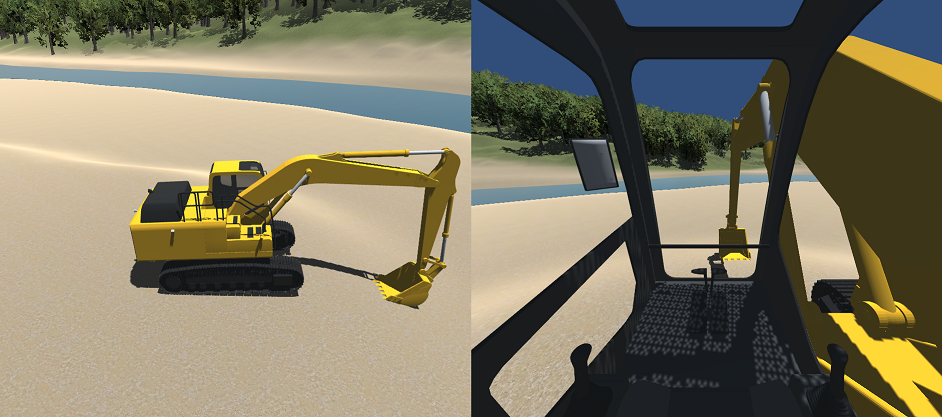

# Unity excavator

This project is a cumulation of my weekend works on Unity, to operate a 3D model excavator on Unity.



Note: I am working on Windows10 for this creation. I have used Blender to create the 3D model of excavator.

## Requirements

- Unity 2018.4
- [Standard Assets](https://assetstore.unity.com/packages/essentials/asset-packs/standard-assets-for-unity-2017-3-32351)
- Optional: [Logicool Gamepad F310](https://www.logitechg.com/en-us/products/gamepads/f310-gamepad.940-000110.html)

## Operation

### PC keyboard

```

[Travel levers]
O: Right track reverse
U: Right track forward
Y: Left track forward
R: Left track reverse

      RTUYIOP
      FGH LJI
  
[Operation levers]
I: Boom roll in
K: Boom roll out
L: Bucket roll out
J: Bucket roll in
T: Arm roll out
G: Arm roll in
H: Swing right
F: Swing left

```

### Logicool Gamepad F310

Use the left and right joysticks. Push B button to switch between the operation lever mode and the travel lever mode.

### Autonoumous driving/construction (experimental)

Press "1", "2", "3", "4", "5" or "6" key on the PC keyboard.

## Cameras

The excavator is equipped with four cameras:
- operator view
- three rear cameras (initially disabled)

The rear cameras support mirror view.

To enable the rear cameras, check Excavator -> ExcavatorController -> Enable Rear Cameras.

## Mathematics and Physics

I have applied IK to bucket positioning for autonomous driving/construction: Euler angles at the boom joint and the arm joint are caluculated based on Cosine Theorem.

I attached Rigidbody and Colliders to the excavator with Gravity enabled.

Regarding autonomous driving/construction, it is just about caliculation of the bucket's orbit by using Classical Dynamics.

However, it will also be a good experiment to apply Unity ML-Agents to the caliculation: Physics vs Statistics.

## Working with point cloud

It is possible to replace the virtual terrain with real terrain by importing poing cloud data.

I use [CloudCompare](https://www.danielgm.net/cc/) to convert LAS point cloud data to FBX mesh, then use Unity's Raycast APIs to convert FBX mesh to Terrain. Refer to this wiki: https://wiki.unity3d.com/index.php/Object2Terrain

I sometimes download point cloud data from this site for some experiments on Unity: https://pointcloud.pref.shizuoka.jp/lasmap/ankenmap

Note: Unreal Engine 4 supports "LiDAR Point Cloud" plugin that can import LAS data into a level on Unreal Engine.
