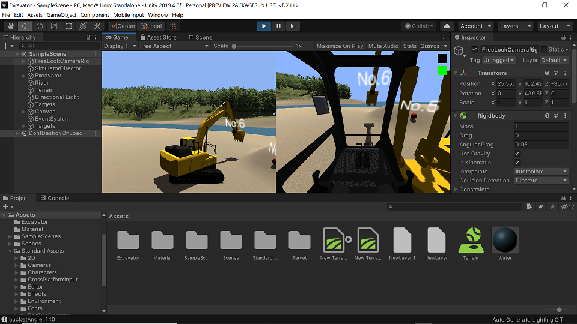

# Unity excavator

This project is an achivement of my self-study on digital twin in my spare time at night and on weekends.



Note: I am working on Windows10 for this creation. I have used Blender to create the 3D models in this project.

## Demo videos

- [Excavator](https://www.youtube.com/watch?v=0X4c5gxU6-A)
- [Pendulum](https://www.youtube.com/watch?v=2AjkpGLnm74)
- [Friction](https://www.youtube.com/watch?v=5SQ1QVdskcI)
- [Solar system](https://www.youtube.com/watch?v=2z0K-X5a5Ss)
- [Total station](https://www.youtube.com/watch?v=Is45dRC3fNM)

## Requirements

- [Unity 2019.4 LTS](https://unity.com/releases/2019-lts)
- [Standard Assets](https://assetstore.unity.com/packages/essentials/asset-packs/standard-assets-for-unity-2017-3-32351)
- Optional: [Logicool Gamepad F310](https://www.logitechg.com/en-us/products/gamepads/f310-gamepad.940-000110.html)

## Android support

I have confirmed that the project names with bold fonts run on my Google Pixel4.

### Coping with this error where Standard Assets are used with Unity 2019.4

```
Assets\Standard Assets\Utility\SimpleActivatorMenu.cs(11,16): error CS0619: 'GUIText' is obsolete: 'GUIText has been removed. Use UI.Text instead.'
```

Just remove "Assets\Utility\ForcedReset.cs" and "Assets\Utility\SimpleActivatorMenu.cs".

## Projects

### Vehicle operation

- [Excavator manual/autonomous operation](./doc/Excavator.md)
- **[Autonomous guided vehicle](./doc/AGV.md)**

### Classical Physics with Rigidbody on Unity

- **[Basic Classical Physics (Dynamics) simulation on Unity](./doc/BasicClassicalPhysics.md)**

### Working with surveying data

- [Converting LAS point cloud data to Unity's Terrain object](./doc/PointCloud.md)
- **[Total Station simulation](./doc/TotalStation.md)**
- [Terrain height map manipulation](./doc/HeightMapManipulation.md)
- **[PTZ camera and point cloud](./doc/PTZCamera.md)**

### Camera/image

- **[Depth camera simulation](./doc/DepthCamera.md)**
- [Chroma key](./doc/ChromaKey.md)

### AI

- [Integration with TensorFlow Lite on Android](./doc/TensorFlowLite.md)
- [Pascal VOC XML auto-generation](./doc/PascalVOC.md) 

### IoT

- **[Fresnel zone](./doc/FresnelZone.md)**

### UI

- [Gamepad Logicool F310](./doc/GamepadF310.md)
