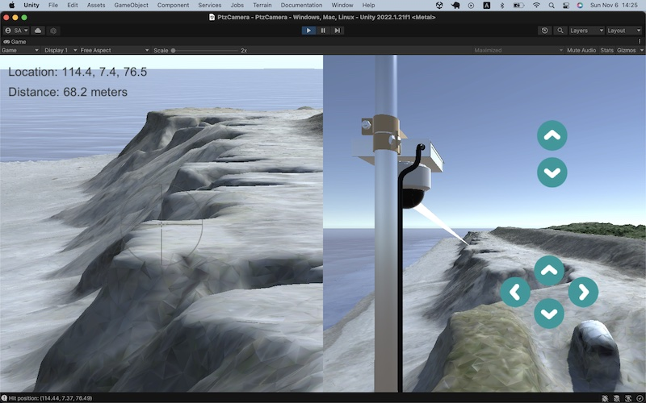

# Unity excavator

This project is an achivement of my self-study on digital twin in my spare time.

<table>
<tr><td>

</td>
<td style="margin: 20px;" >

</td></tr>
<tr><td>

</td>
<td style="margin: 20px;" >

</td></tr>
<table>

## Demo

### WebGL-version

- [Basic classical Physics](https://araobp.github.io/unity-excavator/www/basic_classical_physics/)
- [Pneumatic Caisson](https://araobp.github.io/unity-excavator/www/pneumatic_caisson/)
- [Total station](https://araobp.github.io/unity-excavator/www/total_station/)
- [AGV](https://araobp.github.io/unity-excavator/www/agv/)

### YouTube

- [Excavator](https://www.youtube.com/watch?v=0X4c5gxU6-A)
- [Pneumatic Caisson](https://youtu.be/3EMcrRJ446w)
- [Pendulum](https://www.youtube.com/watch?v=2AjkpGLnm74)
- [Friction](https://www.youtube.com/watch?v=5SQ1QVdskcI)
- [Solar system](https://www.youtube.com/watch?v=2z0K-X5a5Ss)
- [Total station](https://www.youtube.com/watch?v=Is45dRC3fNM)
- [Render Streaming](https://youtu.be/CTrM93eaq1s)

## Requirements

- [Unity 2019.4 LTS](https://unity.com/releases/2019-lts) ... I have been upgrading some of these projects with Unity 2022.1
- [Standard Assets](https://assetstore.unity.com/packages/essentials/asset-packs/standard-assets-for-unity-2017-3-32351)
- Optional: [Logicool Gamepad F310](https://www.logitechg.com/en-us/products/gamepads/f310-gamepad.940-000110.html)

## Android support

I have confirmed that the project names with bold fonts run on my Google Pixel4.

### Coping with this error where Standard Assets are used with Unity 2019.4

```
Assets\Standard Assets\Utility\SimpleActivatorMenu.cs(11,16): error CS0619: 'GUIText' is obsolete: 'GUIText has been removed. Use UI.Text instead.'
```

Just remove "Assets\Utility\ForcedReset.cs" and "Assets\Utility\SimpleActivatorMenu.cs".

## Projects

### Vehicle operation

- [Excavator manual/autonomous operation](./doc/Excavator.md)
- [Pneumatic Caisson](./doc/PneumaticCaisson.md)
- [Autonomous guided vehicle](./doc/AGV.md)

### Classical Physics with Rigidbody on Unity

- [Basic Classical Physics (Dynamics) simulation on Unity](./doc/BasicClassicalPhysics.md)

### WebRTC

- [Render Streaming](./doc/RenderStreaming.md)

### Working with surveying data

- [Converting LAS point cloud data to Unity's Terrain object](./doc/PointCloud.md)
- [Total Station simulation](./doc/TotalStation.md)
- [Terrain height map manipulation](./doc/HeightMapManipulation.md)
- [PTZ camera and point cloud](./doc/PTZCamera.md) ([Unity 2022.1] Latest update: November 6th, 2022)

### Camera/image

- **[Depth camera simulation](./doc/DepthCamera.md)**
- [Chroma key](./doc/ChromaKey.md)

### AI

- [Integration with TensorFlow Lite on Android](./doc/TensorFlowLite.md)
- [Pascal VOC XML auto-generation](./doc/PascalVOC.md) 

### IoT

- [Fresnel zone](./doc/FresnelZone.md) ([Unity 2022.1] Latest update: November 6th, 2022)

### GNSS(GPS)

- [GNSS](./doc/GNSS.md) ([Unity 2022.1] Latest update: November 6th, 2022)

### AssetBundle

- [AssetBundle](./doc/AssetBundle.md) ([Unity 2021.3] Latest update: November 8th, 2022)

### UI

- [Gamepad Logicool F310](./doc/GamepadF310.md)
- [VR goggle with PC as an input device](./doc/VR_Input.md)
