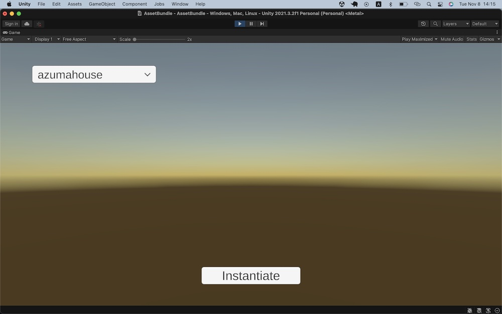
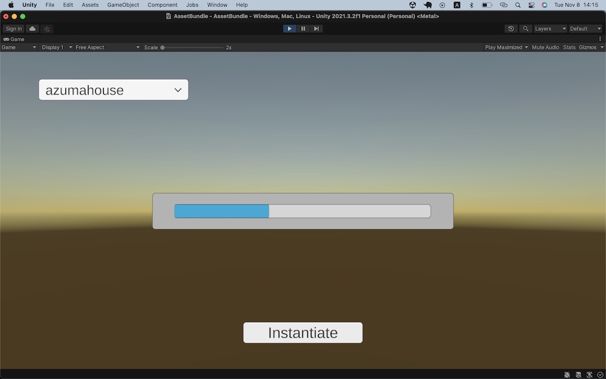
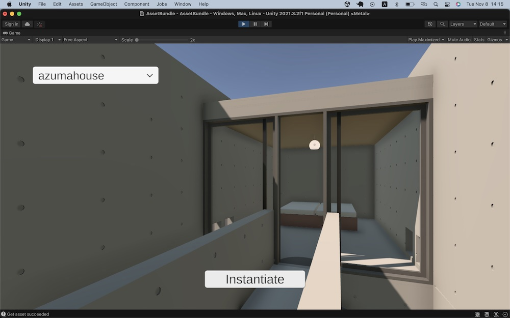
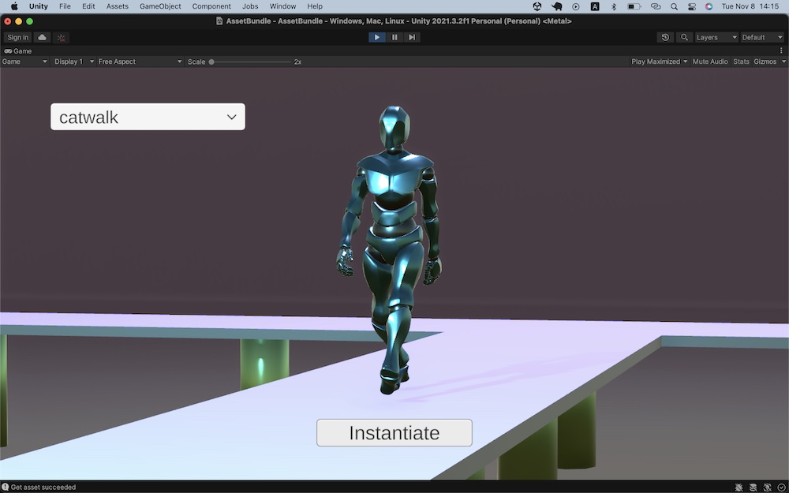
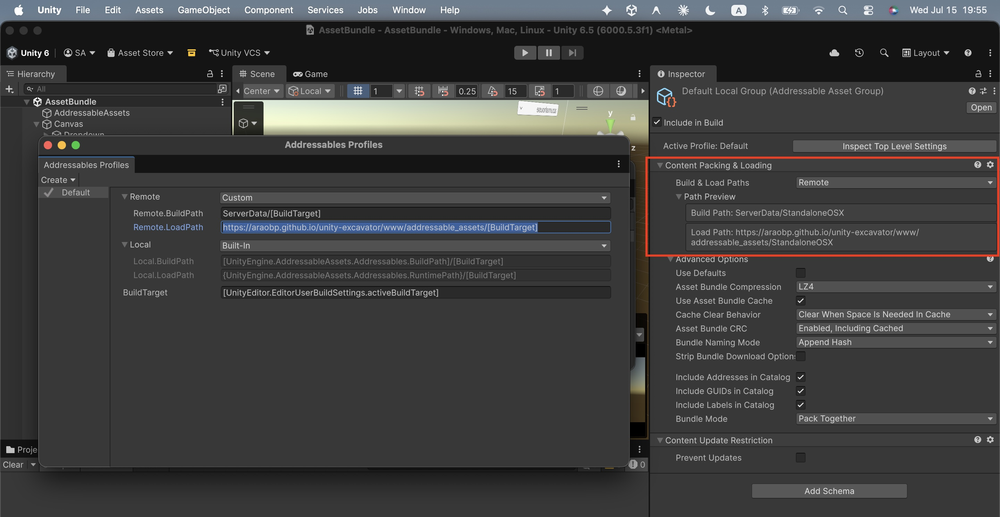

# AssetBundle (Addressable Assets)

This project is to show how to use Github Pages as an Addressable Assets server for Unity applications.

Note: 

It is not a good idea to use Github Pages as a AssetBundle server, because it supports neither authentication nor authorization. This project is for a demo purpose only.

## Code

=> [Code](../AssetBundle) 

## Remote Load Path setting

## References

- [Getting Started with Addressables](https://www.youtube.com/watch?v=AFMkXYiquB0)
