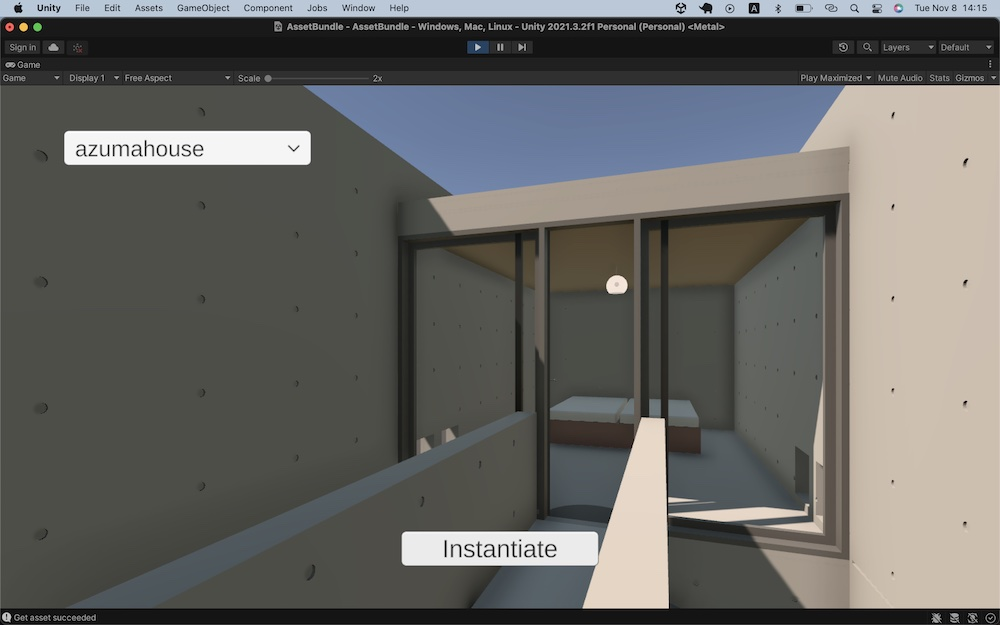

# AssetBundle

This project is to show how to use Github Pages as an AssetBundle server for Unity applications.

Note: 

It is not a good idea to use Github Pages as a AssetBundle server, because it supports neither authentication nor authorization. This project is for a demo purpose only.

## Code

=> [Code](../AssetBundle) 
