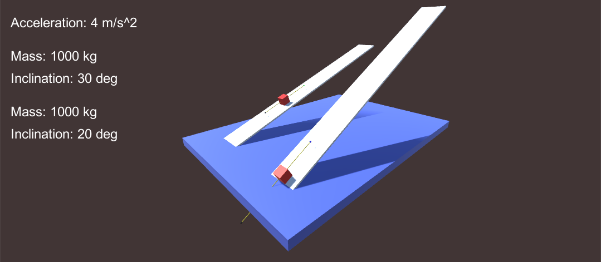

# Basic classical Physics

This project has multiple scenes:

- Free fall
- Pendulum
- Slope
- Vector

I have confirmed that all the Physics experiments on Unity follow the lows of Classical Physics.

## Free fall

## Pendulum

## Slope

## Vector

## Code

[=> Code](../BasicClassicalPhysics)

There are multiple scenes in "BasicClassicalPhysics\Assets\Scenes".
