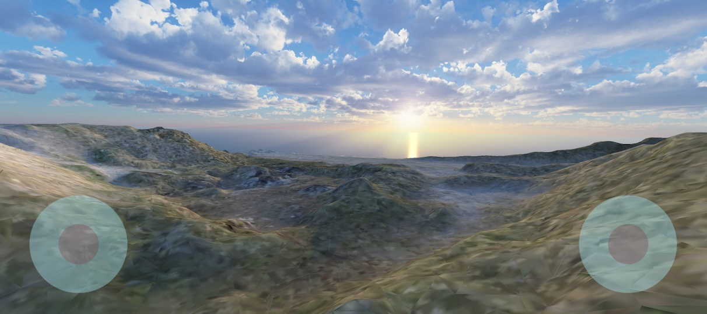

# Drone remote controller for Android

## Package dependencies

- Input System
- URP

## Joypad emulation on Android



## Code

=> [Code](../DroneRemoteController) 


I devised the following part in "StickController.cs" to stabilize the stick position:

```
    public float deltaX
    {
        get => Mathf.Sign(_DeltaX) * Mathf.Pow(_DeltaX, 2);
    }

    public float deltaY
    {
        get => Mathf.Sign(_DeltaY) * Mathf.Pow(_DeltaY, 2);
    }
```

## Camera attitude control

I use InputSystem's AttitudeSensor for controlling camera attitude.

The following code is to support both remote controller emulation and attitude control:

```
    float m_RotationY = 0F;

         :
         
    private void OnEnable()
    {
        InputSystem.EnableDevice(AttitudeSensor.current);
    }
    
    // Start is called before the first frame update
    void Start()
    {
        Screen.orientation = ScreenOrientation.LandscapeLeft;
    }

    // Update is called once per frame
    void Update()
    {
        float deltaTime = Time.deltaTime;

        // Stick Control
        float deltaYLeft = _StickControllerLeft.deltaY * deltaTime * _MultiplierTranslate;
        float deltaXRight = _StickControllerRight.deltaX * deltaTime * _MultiplierRotate;
        float deltaYRight = _StickControllerRight.deltaY * deltaTime * _MultiplierTranslate;
        Transform cam = m_CameraObject.transform;
        cam.Translate(new Vector3(20F * deltaXRight, 20F * deltaYLeft, 40F * deltaYRight));

        float deltaXLeft = _StickControllerLeft.deltaX * deltaTime * _MultiplierTranslate;
        m_RotationY += 100F * deltaXLeft;

        // Camera attitude Control
        Quaternion attitude = AttitudeSensor.current.attitude.ReadValue();
        attitude = Quaternion.Euler(0, 0, -180) * Quaternion.Euler(-90, 0, 0) * attitude * Quaternion.Euler(0, 0, 180);
        cam.transform.rotation = attitude;// * Quaternion.AngleAxis(m_RotationY, Vector3.up);

        // Rotate the camera around Y-axis in world splace
        cam.Rotate(new Vector3(0F, m_RotationY, 0F), Space.World);
    }
}
