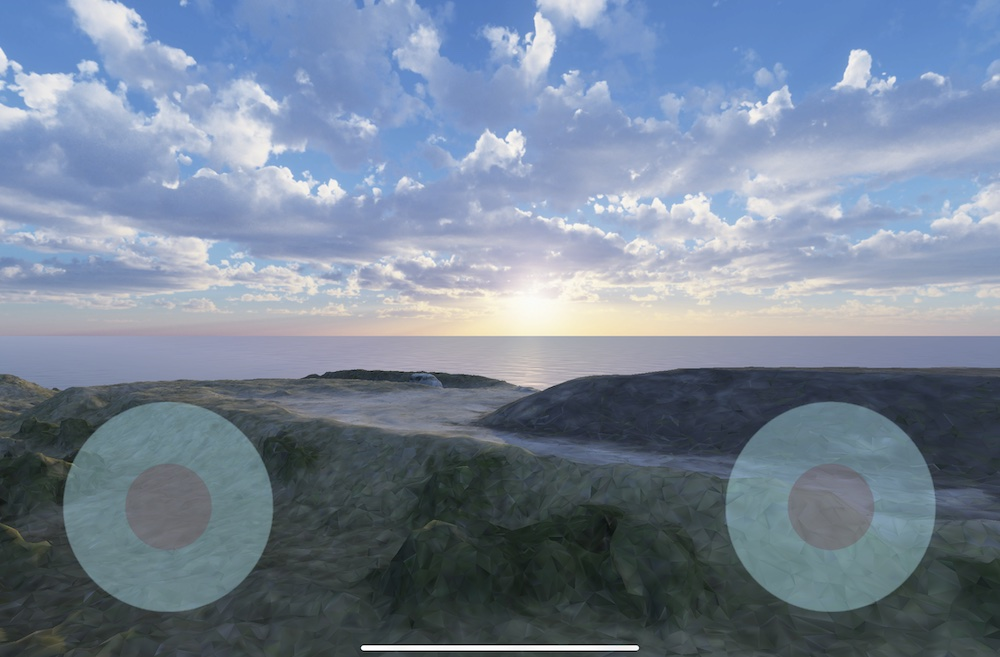

# Drone remote controller for iPad

Not only for iPad but also for other tablet/smartphone models.

However, iPad mini is the best for this remote controller emulation.

## Package dependencies

- Input System
- URP

## Joypad emulation on iPad mini




## Code

=> [Code](../DroneRemoteController) 


I devised the following part in "StickController.cs" to stabilize the stick position:

```
    public float deltaX
    {
        get => Mathf.Sign(m_DeltaX) * Mathf.Pow(m_DeltaX, 2);
    }

    public float deltaY
    {
        get => Mathf.Sign(m_DeltaY) * Mathf.Pow(m_DeltaY, 2);
    }
```
