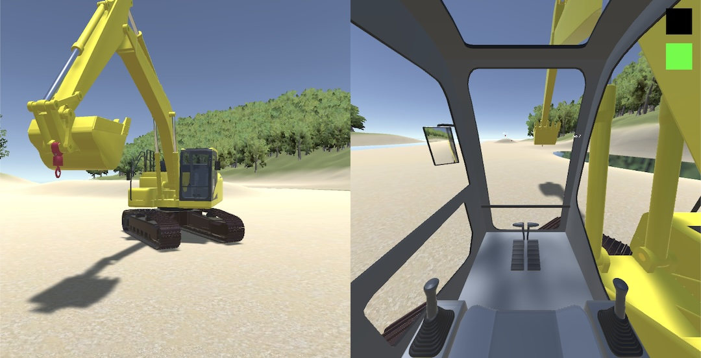
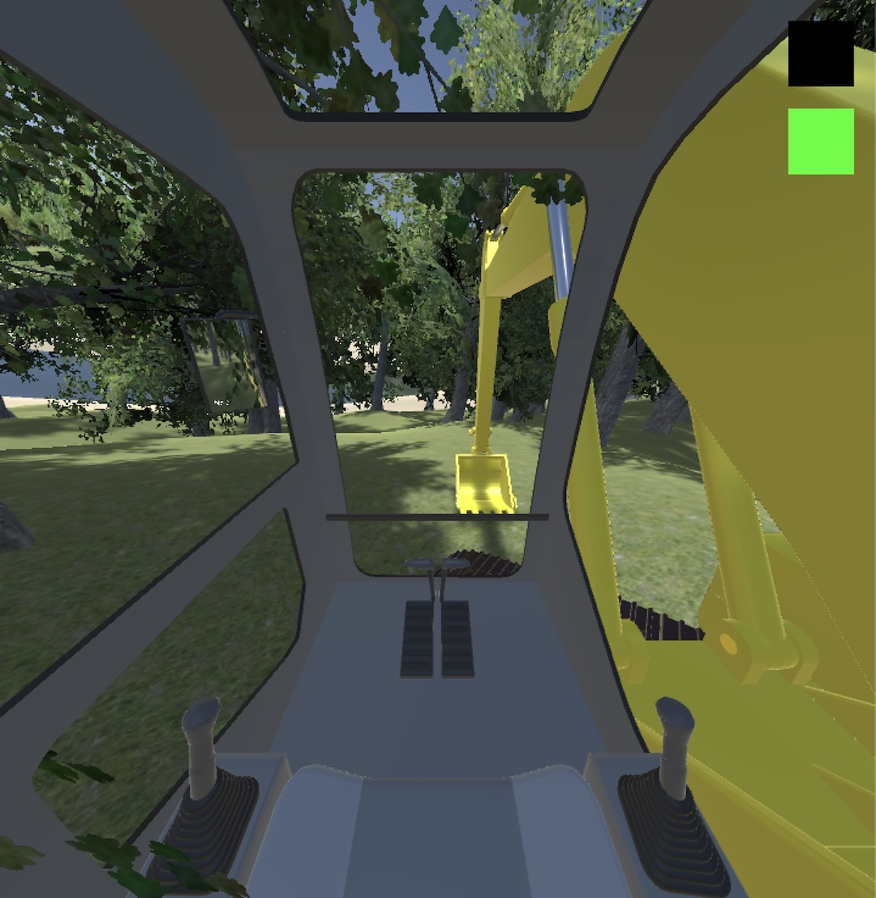
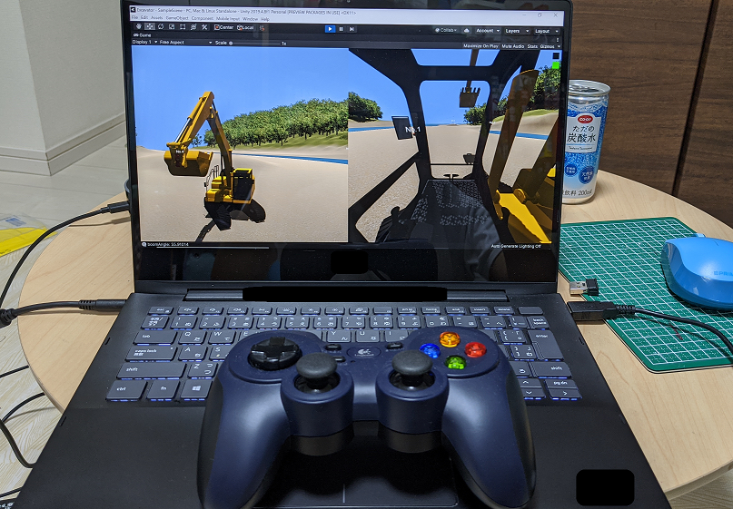

# Excavator





[Demo video](https://www.youtube.com/watch?v=0X4c5gxU6-A)

## Code

[=> Code](../Excavator)

## Operation

### PC keyboard

```

[Travel levers]
O: Right track reverse
U: Right track forward
Y: Left track forward
R: Left track reverse

      RTUYIOP
      FGH LJI
  
[Operation levers]
I: Boom roll in
K: Boom roll out
L: Bucket roll out
J: Bucket roll in
T: Arm roll out
G: Arm roll in
H: Swing right
F: Swing left

```

### Logicool Gamepad F310



Use the left and right joysticks. Push B button to switch between the operation lever mode and the travel lever mode.

### Autonoumous driving/construction (experimental)

Press "1", "2", "3", "4", "5" or "6" key on the PC keyboard.

## Cameras

The excavator is equipped with four cameras:
- operator view
- three rear cameras (initially disabled)

The rear cameras support mirror view.

To enable the rear cameras, check Excavator -> ExcavatorController -> Enable Rear Cameras.

## Armature

The 3D model has a lot of rotary axes. Refer to [these images](../Excavator/geometry).

## Mathematics and Physics

I have applied [IK](../Excavator/jupyter/IK.ipynb) to bucket positioning for autonomous driving/construction: Euler angles at the boom joint and the arm joint are caluculated based on Cosine Theorem.

I attached Rigidbody and Colliders to the excavator with Gravity enabled.

Regarding autonomous driving/construction, it is just about caliculation of the bucket's orbit by using Classical Dynamics.
