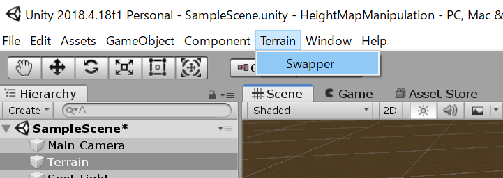
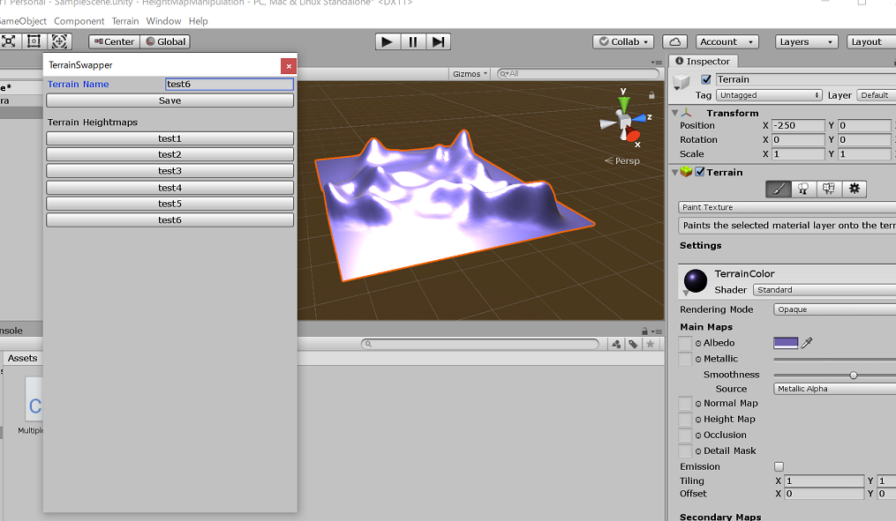
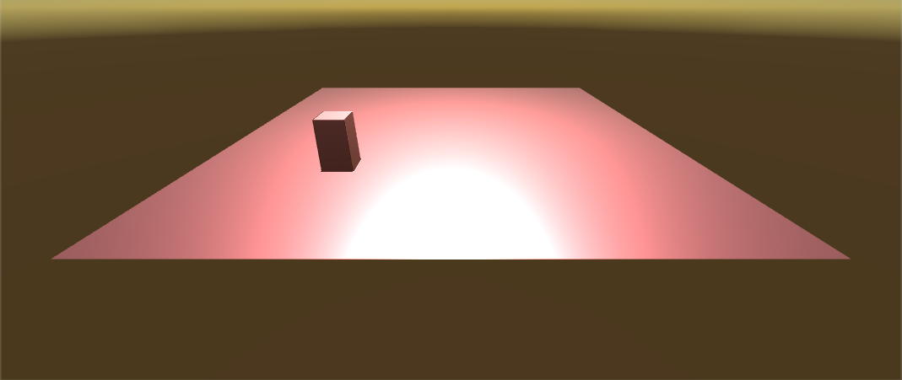

# Height map manipulation

## Code

[=> Code](../HeightMapManipulation)

## Operations

### Saving or swapping a terrain heightmap in edit mode

Make the terrain active by clicking on the terrain, then choose the following on the editor:



Then, "Terrain swapper" edit GUI window appears. Name your terrain and save it.



### Manipulating the terrain



```
hit "R" --> Raise a part of the terrain
hit "L" --> Lower a part of the terrain
hit "F" --> Flatten the terrain
```
