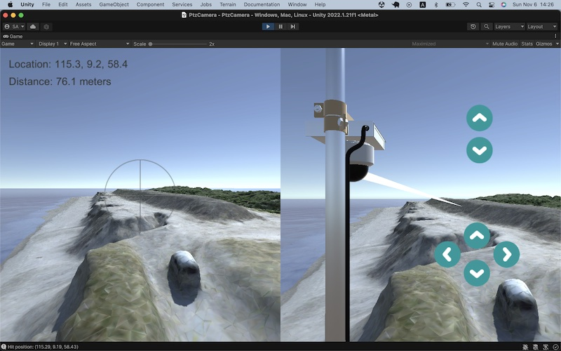

# PTZ Camera with Point Cloud

Note:
- This project has incorporated URP and the Unity's new Input System.
- The FBX-format dune model is from this repo: https://github.com/araobp/pointcloud




## PTZ camera with a virtual Lazer range finder

PTZ camera with a lazer range finder works like a total station. If a terrain generated from point cloud data is in the scene, a virtual PTZ camera with a virual Lazer range finder can locate a point on the terrain and measure the distance to the point.

## Code

=> [Code](../PtzCamera)

## Operations

Press one of the following keys to control the virtual PTZ camera:

```
D: pan right
A: pan left
W: tilt up
S: tilt down
E: zoom in
X: zoom out
```

## Simple Water Shader URP from Unity Asset Store

I use this Water shader in this project. This works great!

https://assetstore.unity.com/packages/2d/textures-materials/water/simple-water-shader-urp-191449

## License

The point cloud data used in this project is from this site: https://pointcloud.pref.shizuoka.jp/lasmap/ankendetail?ankenno=31K2731011101

この作品は、以下の著作物を改変して利用しています。  【出典：静岡県ポイントクラウドデータベース】、CCライセンス 表示 4.0 国際 （https://creativecommons.org/licenses/by/4.0/legalcode.ja）
