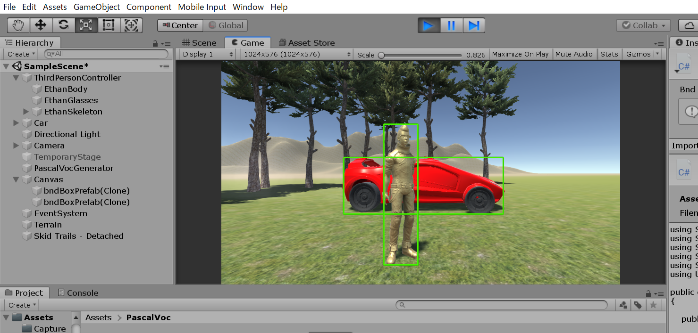
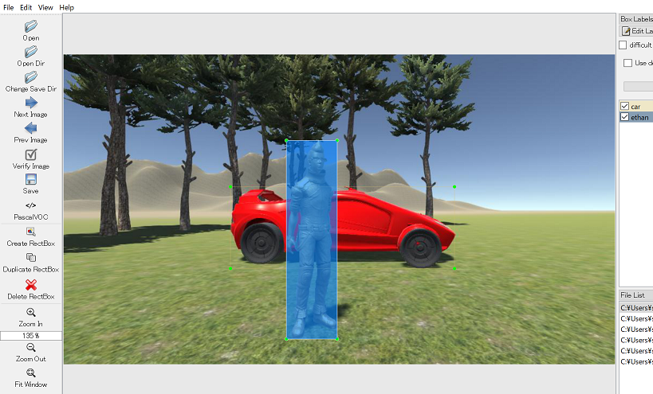

# Pascal VOC XML auto-generation

[LabelImg](https://github.com/tzutalin/labelImg) is an annotation tool for training AI object detection models.

I use it for training SSD-MobileNet v2 model with my original images. LabelImg outputs annotation files in the format of Pascal VOC XML.

This project is to auto-generate annotation files for scenes on Untiy, **without using LabelImg**.

## Generating Pascal VOC XML

Just press "B" to generate a Pascal VOC XML file. The generated file will be saved in "Capture" folder.

## Loading the XML into LabelImg

## How it works

- This implementation uses a Unity's camera as a depth camera to extract a target object only. 
- All the objects with a tag "GreenScreen" is deactivated when extracting the target object from the scene.
- Data about a bounding box of the extracted image is then translated into Pascal VOC XML format.
- Those disabled objects are re-activated just before capturing the scene as an image in JPEG format.

## Code
- [=> Code on Unity](../PascalVOC)
