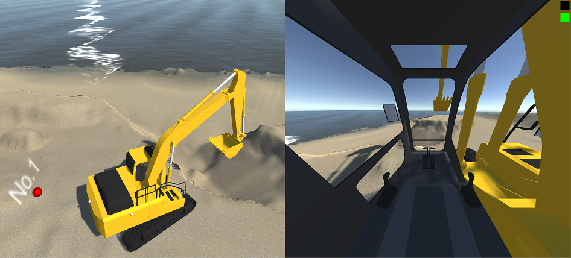

# Point cloud



## Code

[=> Code](../PointCloud)

## Point cloud data conversion pipeline

```
Cloud Compare => Blender => Unity Object (Mesh) => Unity Object (Terrain)
+ Subsample     + Smooth    + 100x scale
+ Mesh          

```

## License

The point cloud data used in this project is from this site: https://pointcloud.pref.shizuoka.jp/lasmap/ankendetail?ankenno=31K2731011101

この作品は、以下の著作物を改変して利用しています。
 【出典：静岡県ポイントクラウドデータベース】、CCライセンス 表示 4.0 国際 （https://creativecommons.org/licenses/by/4.0/legalcode.ja）
