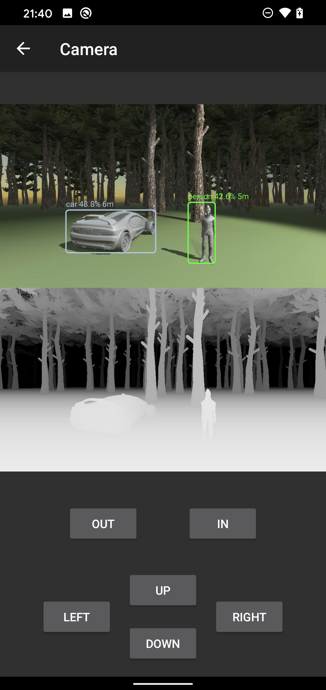

# Integration with TensorFlow Lite on Android



## Architecture

```
Ethan and the car               MobileNetv2/TensorFlowLite
are on Unity                    runs on Android for object detection
 [Unity] <----> [mosquitto] <----> [Android]
                MQTT server
                username: simulator
                password: simulator
```

## How it works

There are two cameras running on Unity to capture image:
- RGB camera
- Depth camera 

These two cameras use "Render Texture" to capture images.

JPEG image data is transferred to an app on Android via MQTT server.

The app on Android receives the JPEG data, coneverts it into Bitmap, then perform object detection by using a pre-trained SSD-MobileNetv2 model on TensorFlow Lite.

## Code
- [=> Code on Unity](../TensorFlowLite)
- [=> Code on Android](../android/camera)
